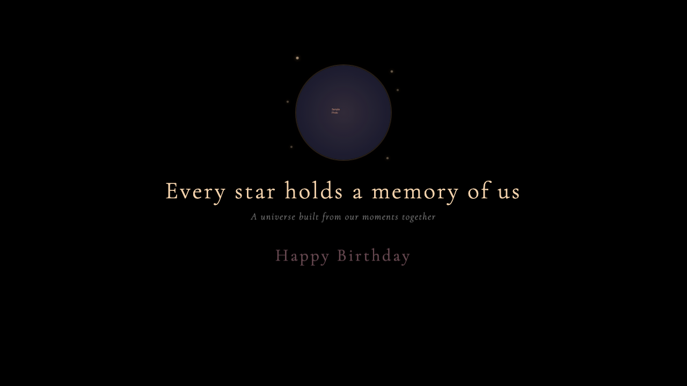
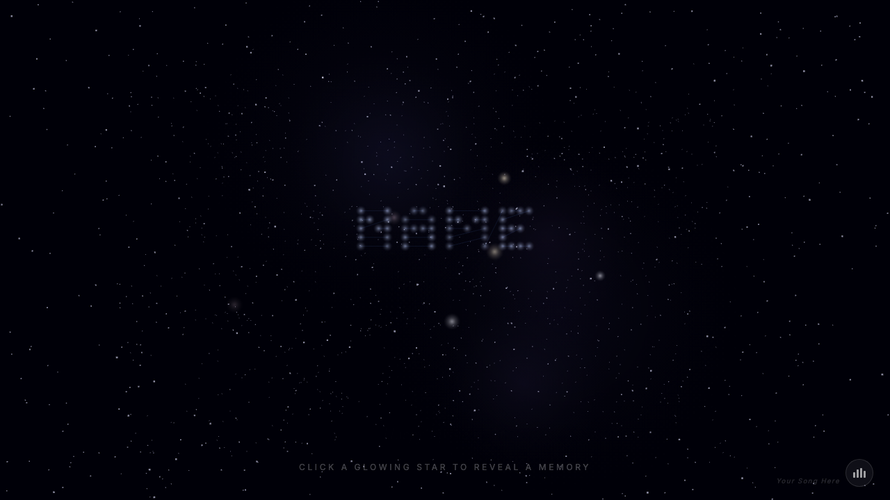
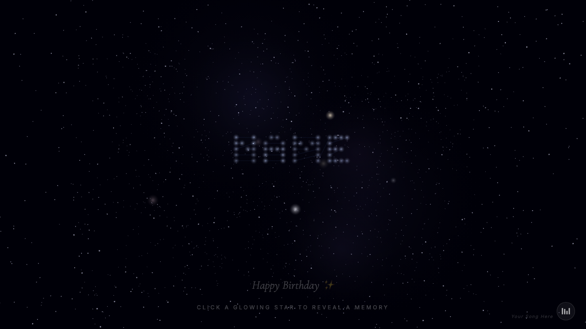

# Birthday Surprises

An interactive 3D starfield experience where every star holds a memory. Built with Three.js and Claude as a birthday gift for someone special.

Their name is spelled out as a constellation across the night sky. Glowing stars scattered around the scene each contain a photo and a heartfelt caption. Friends send birthday wishes as comets streaking across the sky. Background music fades in as the experience begins.

 

## Preview

### Intro Screen


### Starfield with Constellation


### Memory Popup


## Features

- **Constellation Name** — Their name is rendered as connected stars in the sky
- **Memory Stars** — Click any glowing star to reveal a photo and caption
- **Comet Wishes** — Friends' birthday messages fly in as comets
- **Background Music** — Your chosen song plays with fade-in/fade-out controls
- **Shooting Stars** — Periodic shooting stars streak across the sky
- **Nebula Background** — Subtle colored nebulae add depth to the scene
- **Responsive** — Works on desktop, tablet, and mobile (touch supported)
- **No framework** — Pure vanilla JS, zero bloat

## Quick Start

```bash
git clone https://github.com/ankitdotgg/birthday-surprises.git
cd birthday-surprises
npm install
npm run dev
```

Open `http://localhost:5173` in your browser.

## Personalize It

This is a template. Fork it and make it yours in 5 minutes.

### 1. Add Photos

Drop photos into `public/photos/` named sequentially:

```
public/photos/01.jpeg
public/photos/02.jpeg
public/photos/03.jpeg
...
```

### 2. Edit Memories

Open `src/memories.js` and replace the placeholder entries:

```js
export const MEMORIES = [
  {
    date: "Where It All Began",
    text: "Your caption for this photo.",
    image: "/photos/01.jpeg",
    size: "large",  // "small", "medium", or "large"
  },
  // ... add as many as you want
];

export const HER_NAME = "SARA";  // spelled out as a constellation
export const BIRTHDAY_MESSAGE = "Happy Birthday, Sara ✨";
```

### 3. Add Friend Wishes

Open `src/friends.js` to add messages from friends. Each one arrives as a comet:

```js
export const FRIEND_MESSAGES = [
  {
    name: "Alex",
    message: "Happy birthday! You're the best!",
  },
  // ... add more friends
];
```

### 4. Add Music

Drop an audio file (MP3, OGG, or WebM) into `public/` and update `src/music.js`:

```js
audio = new Audio("/your-song.mp3");
```

Update the song credit in `index.html`:

```html
<div id="song-credit">Song Name — Artist</div>
```

### 5. Customize the Intro

Edit the intro text in `index.html` to personalize the landing screen:

```html
<h1 class="intro-hindi">Your headline here</h1>
<p class="intro-sub">Your subtitle here</p>
<p class="intro-birthday">Happy Birthday, Name</p>
<p class="intro-from">— your sign-off</p>
<button id="enter-btn">Enter</button>
```

The intro displays a circular photo with a glowing border — change the `src` in the `` tag to use any of your photos.

## Deploy

Build for production:

```bash
npm run build
```

The `dist/` folder contains everything. Deploy it anywhere:

### Vercel (Recommended — Free)

```bash
npm i -g vercel
vercel
```

Or connect your GitHub repo at [vercel.com/new](https://vercel.com/new) — auto-deploys on every push.

### Netlify (Free)

```bash
npm i -g netlify-cli
netlify deploy --prod --dir=dist
```

Or drag-and-drop the `dist/` folder at [app.netlify.com/drop](https://app.netlify.com/drop).

### GitHub Pages (Free)

1. Go to your repo Settings > Pages
2. Set source to GitHub Actions
3. Create `.github/workflows/deploy.yml`:

```yaml
name: Deploy
on:
  push:
    branches: [main]
jobs:
  deploy:
    runs-on: ubuntu-latest
    permissions:
      pages: write
      id-token: write
    environment:
      name: github-pages
      url: ${{ steps.deployment.outputs.page_url }}
    steps:
      - uses: actions/checkout@v4
      - uses: actions/setup-node@v4
        with:
          node-version: 20
      - run: npm install && npm run build
      - uses: actions/upload-pages-artifact@v3
        with:
          path: dist
      - uses: actions/deploy-pages@v4
        id: deployment
```

Your site will be live at `https://yourusername.github.io/birthday-surprises/`.

### Cloudflare Pages (Free)

1. Go to [dash.cloudflare.com](https://dash.cloudflare.com) > Workers & Pages > Create
2. Connect your GitHub repo
3. Build command: `npm run build`
4. Output directory: `dist`

### Raspberry Pi / Any Server

```bash
# Build locally
npm run build

# Copy to server
rsync -avz --delete dist/ user@your-server:/var/www/birthday/

# Nginx config
server {
    listen 80;
    server_name birthday.yourdomain.com;
    root /var/www/birthday;
    index index.html;
    try_files $uri $uri/ /index.html;

    gzip on;
    gzip_types text/css application/javascript image/svg+xml;
}
```

### Docker

```dockerfile
FROM node:20-alpine AS build
WORKDIR /app
COPY package*.json ./
RUN npm ci
COPY . .
RUN npm run build

FROM nginx:alpine
COPY --from=build /app/dist /usr/share/nginx/html
EXPOSE 80
```

```bash
docker build -t birthday-surprises .
docker run -p 8080:80 birthday-surprises
```

### Cloudflare Tunnel (Custom Domain, No Port Forwarding)

If your server is behind a firewall (like a Raspberry Pi at home):

```bash
# Install cloudflared on your server
cloudflared tunnel create birthday
cloudflared tunnel route dns birthday stars.yourdomain.com
cloudflared tunnel run --url http://localhost:80 birthday
```

## Tech Stack

- **Three.js** — 3D rendering, particle systems, sprite materials
- **Vite** — Build tool and dev server
- **Vanilla JS** — No framework, pure DOM manipulation
- **CSS** — Custom animations, backdrop blur, responsive design

## How It Works

1. **Intro Screen** — Photo with glowing border, animated text, enter button
2. **Constellation** — Name is converted to coordinate points and rendered as connected stars
3. **Memory Stars** — Positioned using golden angle distribution for natural spread
4. **Raycasting** — Three.js raycaster detects hover/click on star sprites
5. **Comets** — Friend messages animate in as glowing sprites, pause, then display a card
6. **Music** — HTML5 Audio with volume fade-in/fade-out for smooth transitions

## Use Cases

This isn't limited to romantic partners. Use it for:
- **Partner/Spouse** — Photos from your relationship, love notes as captions
- **Best Friend** — Friendship milestones, inside jokes
- **Parent** — Family photos across the years, gratitude messages
- **Sibling** — Childhood memories, shared adventures
- **Anyone** — Anyone whose birthday you want to make unforgettable

## License

MIT — Use it, fork it, gift it.
